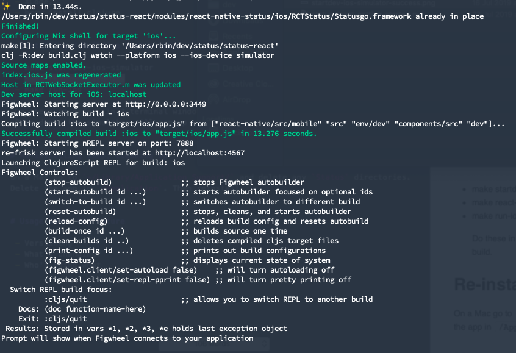
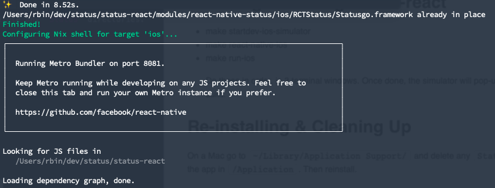
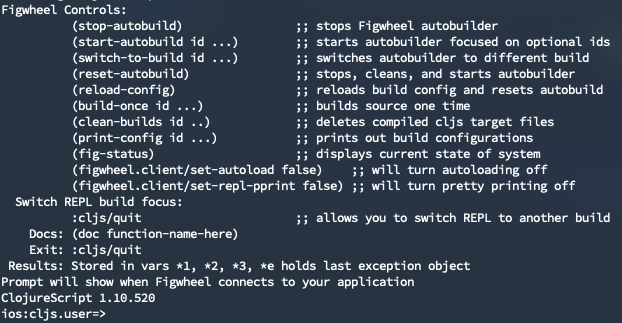

Getting Started with Status-react
==================================

Status is an open source community of people committed to building better, decentralised tools for web3, and making sure that everyone across the world can access these tools directly from their pockets.

If *peer-to-peer electronic payment systems* are really going to change the ways we interact and organise as a society, then we need to make sure that as many people can take part in these networks as possible. Just as importantly, the tools they have  access to must support web3 without making compromises that might keep the playing fields permanently skewed.  People everywhere need to be able to connect, transact, explore, and create value with as much ease and freedom as bankers on Wall Street.


# Introducing Status-react

Status-react is where most of what might traditionally be called the “frontend” logic sits (everything to do with UI components and interactions, chats, views etc.) and status-go is where all the heavier blockchain logic sits. Status-go can be compiled as a stand alone library, and gets included as a static dependency in status-react at build time.

Status-react is actually written in Clojure &amp; ClojureScript, which is a Lisp-like language that can be compiled down to React Native, so that we only have to maintain one codebase for Android, iOS and our desktop app.

Clojure / CLJS is one of the most performant frontend tools around; enabling the greatest productivity, with the fewest lines of code. However, a lot of that is lost in the compilation down to React Native, so what are our real motivations?

With Clojure you get a complete separation of functions and data. This means we can do amazing things in Status extensions that allow developers a lot of access to different parts of the data, that now lives client side in decentralised networks, without compromising on the security of our users.

The goal of this tutorial is to get someone new to Status-react to the point where they can evaluate expressions in-line in their editor. Inline evaluation is one of the things that makes Clojure both fun and powerful.

What follows is the definitive account of how to get to that “aha” moment, specifically for the **iOS dev build of Status-react**.  With this built, you can start contributing as soon as you wish!  

**If you want to contribute to a different build (i.e. the desktop client) you can read [*this guide*](https://status.im/guides/desktop_inline_eval.html).**


# Initial Setup

With this quick start guide being for the iOS dev build, we're assuming that you are Mac based.  **For guides on building Status-react on Ubuntu, [you can see here.](https://status.im/guides/desktop_inline_eval.html)**

The first requirement is XCode.  If you do not wish to install it from the Mac App store, there is a great guide on installing XCode and the XCode Dev Toolkit via command line, [here.](https://www.moncefbelyamani.com/how-to-install-xcode-homebrew-git-rvm-ruby-on-mac/)

Now, with XCode / Dev Toolkit installed, we can get on with the main building of Status-react and start contributing in earnest!


# Installing / Building Status-react

Building out your own dev version of Status is the best way to experiment before submitting actual contributions to the main codebase.  The process for building your iOS dev app is relatively simple, **but if the following steps are not run in the correct order, the build will output nothing but errors! **

Open up three terminal windows (or tabs), and ensure you keep all three open.  In the first, enter the command:

```
make startdev-ios-simulator
```

Under the hood, this command runs the equivalent of:
    
`clj -R:dev build.clj watch --platform ios --ios-device simulator`
 

With that entered, you should see the following, after a short time:



With Figwheel started, re-frisk started, and the ClojureScript REPL started, you can move onto the second window, and enter the next command:
 
```
make react-native-ios
```

By executing this make script, a Nix environment will be created for iOS, running status-go in the background, and Metro Bundler in the foreground.  Upon success, after a short while you should see:



The image above reflects how the terminal window will remain, until the third command has been successfully executed.  Head into the third Terminal window, and enter: 
 
```
make run-ios
```

This Make script will start up the iOS debugger / simulator.  This is the main reason we had to ensure XCode was installed at the beginning of this guide.  With this successfully run, not only will the iPhone simulator open up, but in the terminal window, you should see:


As you can see in the image, the Status Ethereum debug client is started, and we're nearly ready to go!

If you open back up the second Terminal window, you will see the dependency graphs now building out, and the progress being charted:


Finally, if you open back up the first Terminal window, you will see the ClojureScript REPL started and ready to go:



This REPL is where you can execute your Clojure code, making any additions / edits to the Status dev codebase!

So, with all of these commands successfully run, you're now ready to go, and (hopefully) have reached that "aha!" moment for status-react!


# Debugging &amp; Developing with re-frisk

As mentioned above, our Makefiles loaded up a re-frisk instance for us, to aid development / debugging.  If you open a browser window and head over to `http://localhost:4567` – you can make use of this. 


# Re-installing & Cleaning Up

If for any reason you need to completely clean up Status, go to `~/Library/Application Support/` and delete any `Status` directories. Delete the app in `/Application`. Then you are ready to reinstall.

You can also purge / clean up Nix by running the command:

```
make nix-purge
```
