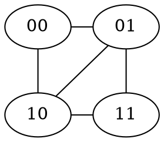
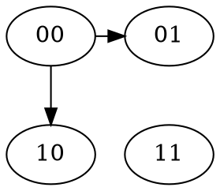
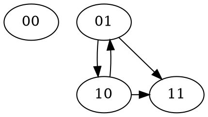
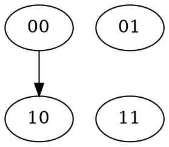
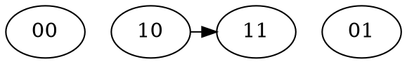

# Whisper - Comparison with the Postal Service over Swarm (PSS)

## Overview

Whisper and PSS are two messaging procotols currently being developed in the Ethereum stack - here's a side-by-side comparison that can help guide your choice between them.

### Similarities

* Online-first protocols - no built-in offline capability / expectation
* Symmetric and asymmetric encryption available
* Implemented on top of DevP2P
    * DevP2P offers encryption between directly connected peers in the underlying overlay network, but this [encryption is broken](https://github.com/ethereum/devp2p/issues/32)
    * A second layer of encryption is done in an end-to-end fashion at the Whisper/PSS level
* 4-byte topic acts as hint for decryption
    * clients have to agree on topics out-of-band
* Recipient anonymity: ability to decrypt makes you a recipient
    * Bloom filters and addressing limit anonymity in Whisper and PSS respectively
* Sender anonymity: peers generally can't tell if neighbour peer is message originator
    * Being fully surrounded by cooperating adverserial nodes breaks this (similar to an eclipse attack)
    * Light clients that don't repeat traffic will leave more obvious metadata trail
    * Global Passive Adversary can possibly detect origin of envelope
* When used without bloom filters or without addressing, routing is equivalent for Whisper and PSS respectively

### Differences

| Feature | Whisper | PSS |
| ------- | ------- | --- |
| Routing | [Gossip](#Gossip) | [Kademlia](#Kademlia) |
| DoS protection | [Proof of work](Proof-of-work) | [Swap incentives](#Swap-incentives) |
| Bandwidth  vs darkness | [Topic-based bloom filters](#Bloom-filtering) - intermediary / recipient decides | [Partial addressing](Partial-addressing) - sender decides |
| Encryption in API | Mandatory | Optional |
| Key exchange | N/A | Optional Diffie-Hellman |
| Message lifetime | [Time-to-live](#Time-to-live) (sender decides) | One pass through each intended node |

## Whisper

Whisper is a gossip-based combination of a messaging protocol and ephemeral value store - values circulate in the system until expiry. The value store view is perhaps more apt - you throw messages into the cloud of participating nodes and they keep getting replicated until expiry, even when new nodes join.

### Gossip

* Connected peers form a "random" subset of all nodes in network
* Each message is sent to all connected peers
* Each time a message is sent to a peer, it's also added to a seen list for that peer
* Multiple peers will send you the same message - only propagated to those that don't have it on the seen list already
* Scalability issues:
    * each node sees each message multiple times
    * too many restricted nodes will cause low propagation probability
    * see https://hackmd.io/B-W4T1SzSgCAbYS2CfoIPg for further analysis

### Proof of work

* PoW calculated over `expiry, ttl, topic, data, nonce` meaning that you need both a timestamp and contents of message to create the PoW
* `pow = (2^BestBit) / (size * TTL)` meaning that large messages or those with long TTL are penalized
* Tricky for heterogenous devices

### Bloom filtering

* Topics are compressed to a bloom filter that is sent to directly connected peers
* Peers only forward messages to you that match filter
    * Violators are disconnected
* Recipient decides how "dark" it wants to be by revealing a more or less accurate bloom filter
* Aggressive bloom filtering can cause network partitioning, makes nodes less valuable in network
* Nodes repeat messages to peers in order to achive sender metadata safety
    * Works as long as you're not surrounded by coordinated malicious peers
    * Bloom filters limit efficiency

### Key exchange

* Must be done out-of-band

### Time to live

* Sender decides on a time-to-live for messages, and pays PoW for it
* Messages are kept/cached in every node until their TTL expires
* If a new node connects, it will receive all messages whose TTL has not yet expired
* Together with topics and capability to decrypt, this can be seen as an ephemeral key-value store of sorts

## PSS

PSS wraps whisper and adds the swarm routing protocol to add deteministic routing. With PSS, routing is done along the kademlia path up to the partial address that was supplied - then gossip takes over.
Unlike Whisper, there is no DHT-like functionality where new nodes are updated on the "current" database of messages.

https://swarm-guide.readthedocs.io/en/latest/pss.html
https://swarm-guide.readthedocs.io/en/latest/resources.html

### Kademlia

* Overlay networked addressed by ethereum public key hash
* Kademlia defines a measure of distance between arbirary nodes
* You connect to a subset of all nodes based on these distances so as to reach a good balance between connectivity and distance
* Each hop gets you closer to final destination, similar to a binary search

### Swap incentives

* TODO - not implemented

### Partial addressing

* Place in kademlia overlay determined by ethereum key
* by specifying part of key, we can narrow down the number of hosts that "could" be recipients of message and route towards them - the neighbourhood
* Gossip the remaining bit, among neighbourhood peers
* Path through network depends on source address and the partial address supplied
    * Kademlia assumed to consist of mostly stable nodes with long-term connections - thus one can assume a deterministic path up to the partial addressing point

### Key exchange

* Rudimentary ephemeral diffie hellman exchange part of the API

## Other resources

### Code

* [parity/whisper](https://github.com/paritytech/parity-ethereum/tree/master/whisper)
* [go-ethereum/whisper](https://github.com/ethersphere/go-ethereum/tree/master/whisper)
* [go-ethereum/PSS](https://github.com/ethersphere/go-ethereum/tree/master/swarm/pss)

### Random links
* [When whisper/PSS instead of traditional messaging](https://ethereum.stackexchange.com/questions/47109/when-should-i-use-whisper-or-pss-over-traditional-message-channel-like-aws-sqs)
* [initial pss description](https://gist.github.com/zelig/d52dab6a4509125f842bbd0dce1e9440)
* [go-ethereum p2p samples](https://github.com/nolash/ethereum-samples/tree/master/p2p/devp2p)

## Appendix: Examples

### Whisper message propagation

Notice how `10`, `01` potentially receive message twice (depending on timing) and `11` is guaranteed to recieve twice (in this setup, due to locally limited knowledge in `01`, `10` nodes)

### PSS message propagation

Example propagation to address `1*`:

Either of `10`, `11` could be recipient, message reaches both!
